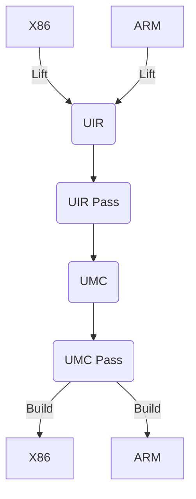

#  UnknownRebuilder
[](https://github.com/NewWorldComingSoon/UnknownRebuilder/actions/workflows/CMake-windows-latest.yml)
[](https://github.com/NewWorldComingSoon/UnknownRebuilder/blob/main/LICENSE)

X86 native code rebuilder using UnknownIR(UIR) and UnknownMC(UMC).



## What's UIR?
Yet another Intermediate Representation(IR) called UnknownIR(UIR).

## What's UMC?
Yet another Machine Code(MC) called UnknownMC(UMC).

## Motivation
Just for learning and fun. Maybe it can help others too.

## Credit
- [cmkr](https://github.com/build-cpp/cmkr)
- [LLVM](https://github.com/llvm/llvm-project)
- [RetDec](https://github.com/avast/retdec)
- [VTIL](https://github.com/vtil-project)
- [Capstone](https://github.com/NewWorldComingSoon/capstone-retdec) 
- [Keystone](https://github.com/NewWorldComingSoon/keystone-retdec)
- [RawPDB](https://github.com/NewWorldComingSoon/raw_pdb)
- [toml11](https://github.com/NewWorldComingSoon/toml11)
- [argparse](https://github.com/NewWorldComingSoon/argparse)
- [LIEF](https://github.com/NewWorldComingSoon/LIEF)
- [TinyXML2](https://github.com/leethomason/tinyxml2)

## Build
Only tested on Windows, other systems have not been tested.
```
cmake -Bbuild -DCAPSTONE_BUILD_TESTS=OFF -DCAPSTONE_BUILD_SHARED=OFF -DCAPSTONE_BUILD_STATIC_RUNTIME=ON -DLLVM_TARGETS_TO_BUILD=X86 -DLIEF_PYTHON_API=OFF -DLIEF_ELF=OFF -DLIEF_MACHO=OFF -DLIEF_OAT=OFF -DLIEF_MACHO=OFF -DLIEF_OAT=OFF -DLIEF_DEX=OFF -DLIEF_VDEX=OFF -DLIEF_ART=OFF -DLIEF_EXAMPLES=OFF -DLIEF_C_API=OFF -DLIEF_ENABLE_JSON=OFF -DBUILD_SHARE_LIBS=OFF
```

## Note
This is currently an unfinished project.
I expect to spend 1 year to complete this project :)
